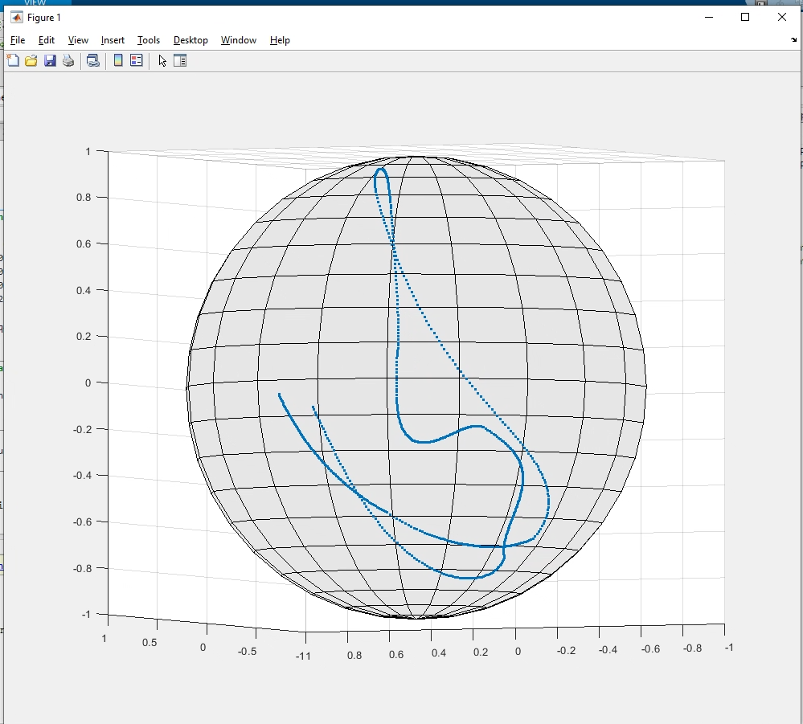
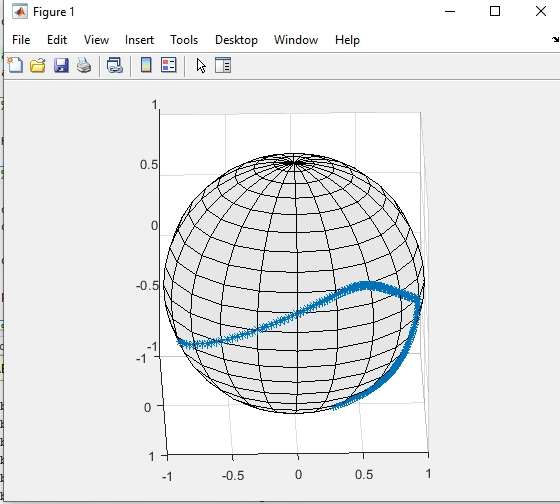
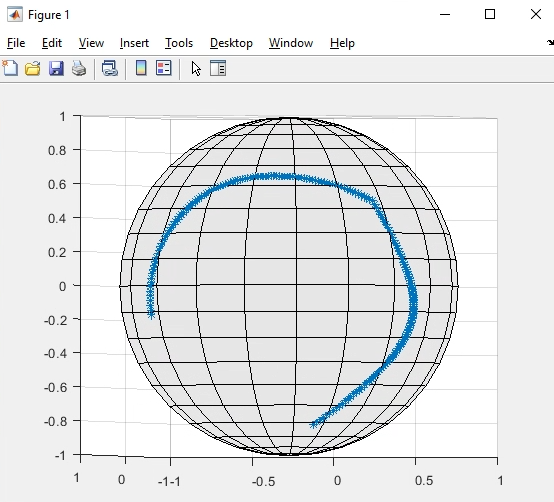
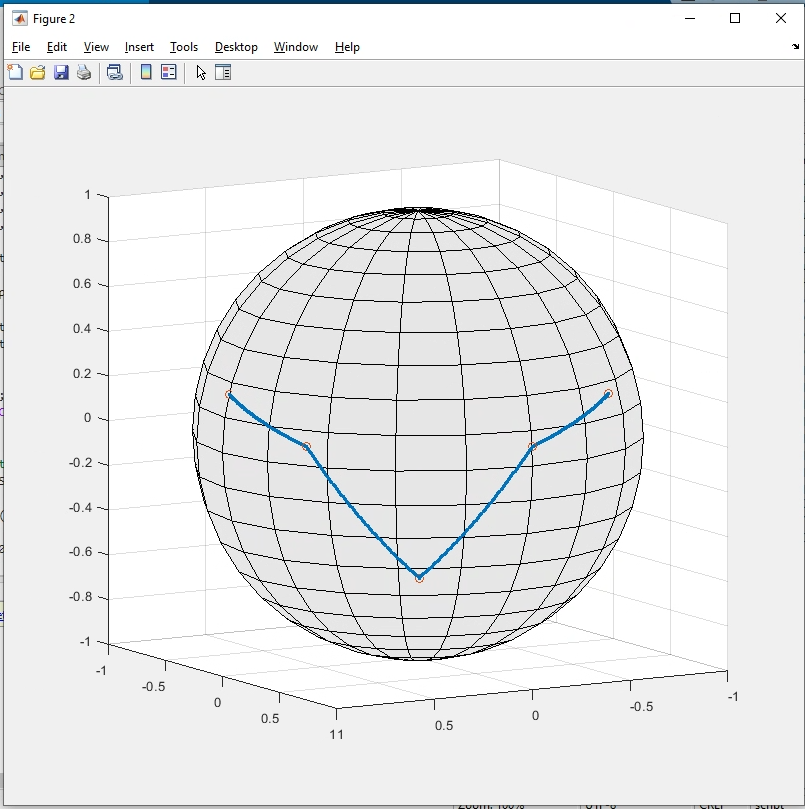
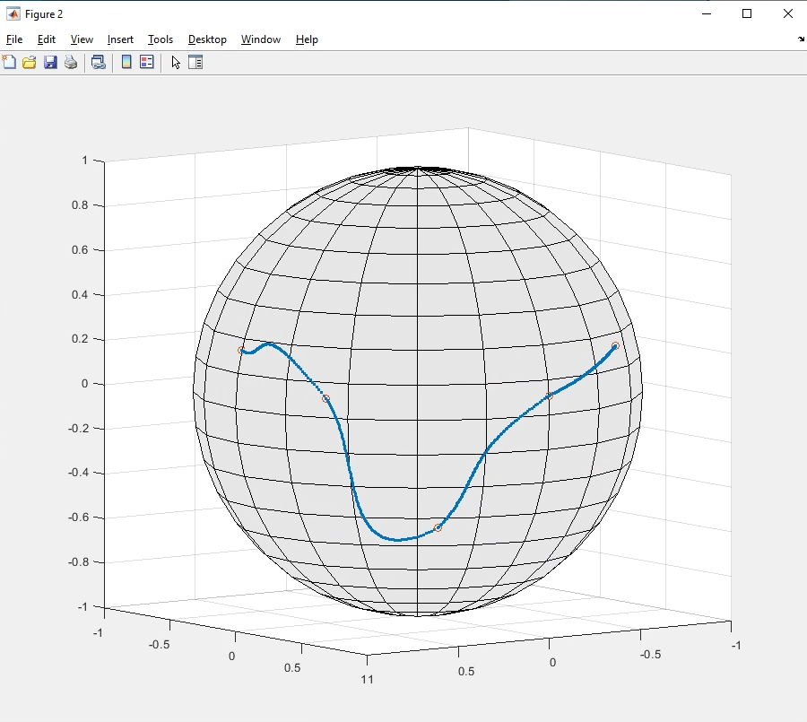
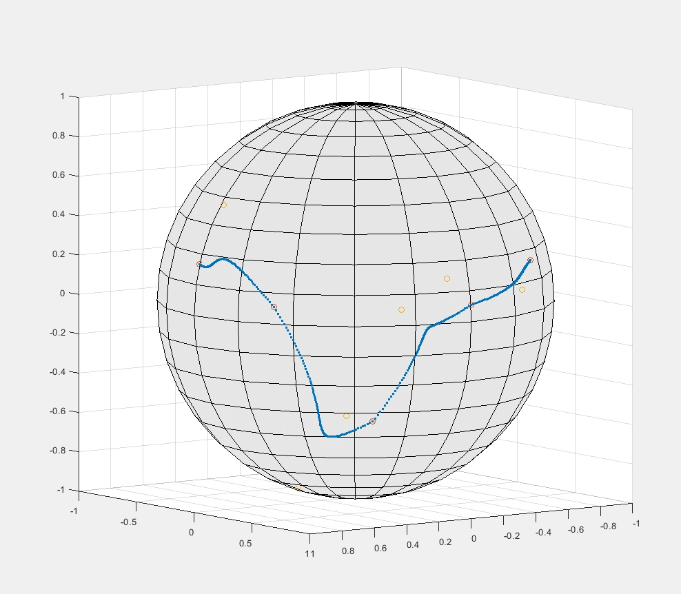

# Squad Prototype in R2023a

## MATLAB Live Script
The live script 'SQUADdemo.mlx' provides a more in depth explanation on the squad function and it's use compared to slerp.

To run the live script, only the mlx file and the 'squad.m' files are necessary.

## Description
Implementation of Squad algorithm for interpolating between series of quaternions. 

The function 'protosquad' takes in the start and end quaternions, 'q1' and 'q2', as well as two additional quaternions, 'a1' and 'a2' that act as auxiliary points to create the tangent for the Bezier curve.

The implementation is similar to that of a Bezier curve, which utilizes a series of three linear interpolations. Since this operation is done on a spherical plane, three Slerp algorithms are executed to accomplish this.

In Figure 1 below, the intial attempt at using Squad between 3 quaternions can be seen. It should be noted that the interpolation at the second point does not provide a smooth curve, which is due to the nature of guessing where the auxillary points fall on the sphere.

Figure 2 displays a slightly better Squad interpolation, resulting from further manual iteration of the auxillary points. However, manual iteration is not ideal for interpolating between series of quaternions.

The function "squad" provides the full implementation fo the algorithm. By providing an array of quaternions and the point to interpolate, a double between 0 and 1, this function is able to calculate the auxillary point using known equations for finding tangents along Squad.

## Visualization

Figure 1. Initial Squad implementation with 3 quaternions

Figure 2. Further iteration with Squad auxillary points

## Usage
Squad interpolation creates a smooth curve between series or quaternions, which allows the sytem to avoid discontinuities which can be seen in Slerp interpolation with series.

For example, a series of quaternions is given below:

q1 = quaternion([0 -15 0], 'eulerd', 'ZYX', 'frame');

q2 = quaternion([30 -5 0], 'eulerd', 'ZYX', 'frame');

q3 = quaternion([60 30 0], 'eulerd', 'ZYX', 'frame');

q4 = quaternion([90 -5 0], 'eulerd', 'ZYX', 'frame');

q5 = quaternion([120 -15 0], 'eulerd', 'ZYX', 'frame');

The following image shows the Slerp method between the quaternions, where sharp corners can be seen on the sphere.

Below, the Squad method is utilized, and it can be seen that the path is smoother, with no sharp corners.

However, it can be seen that the curve is not entirely 'smooth' and some portions appear inefficient. This can be attributed to how Slerp is implemented, which will 'flip' one of the two quaternions when they are pointing in 'opposite' directions. Removing this aspect of the Slerp interpolation, and implementing directly into Squad produces the curve below.

This path is more efficient than the previous implementation and the latter half of the path appears smooth to the end point. There are still aspects of this curve with rougher corners, which may be a limitation of the Squad derivation.

## Project status

Currently, the Squad interpolation has some issues with sharp corners which may be due to the calculation of the auxillary points. In the referenced paper, it appears that some optimization is being done to create smoother curves, as opposed to a single guess.

Additionally, a modified slerp calculation was utilized within the function, which bypasses flipping a quaternion when they are facing opposite directions. This was directly implemented in squad to avoid modification to the slerp function.
